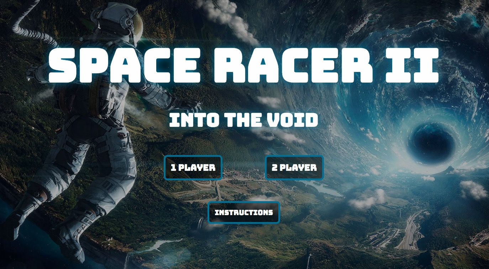
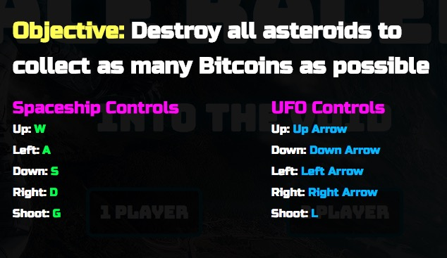

# Space Racer 2: Into the Void

### Project-1 WDI6

## *** [Play Game](https://jintak.github.io/Project-1/) ***

For my first project, I wanted to make a game similar to [Space Invaders](https://en.wikipedia.org/wiki/Space_Invaders). 
I essentially made an extension of my Week-2-Assesment assignment, which is called Space Racer. I would like to keep the same game pieces while changing the functionality of the game. This project will be a shooter type game. You will be able to have two players, who will compete to destroy more asteroids. 

**Basic Functionality**
- Asteroids will populate at the top of the page
- Player will be able to shoot projectile at the enemies
- Asteroids will disappear as they are hit
- User will gain 1 Bitcoin for every asteroid destroyed
- Game is over when all asteroids are extinguished

**Stretch Goals**
- Asteroids will shoot projectiles 
- Asteroids will fly down and attempt to hit the players
- User will be able to choose game background
- User will be able to choose game character

### Technologies Used
My game was constructed using HTML5, CSS3, and Javascript. No frameworks were used in this project.

### Biggest Obstacles
Collision detection was the most difficult aspect of this game. I used a built in Javascript function called, `element.getBoundingRect();`This method returns the size of an element and its position relative to the viewport. I used this method to calculate the positions of the projectiles and the asteroids. I used these positions to calculate the intersection of the two objects, which resulted in collision detection.  

### Unsolved Problems
- Still need to give movement to asteroids. 

[Wireframe](https://wireframepro.mockflow.com/view/Df2fb730c406af0ed6065636ccfa218b3)

[Trello: User Stories](https://trello.com/b/4SNpbblF/space-racer-2-into-the-void)
